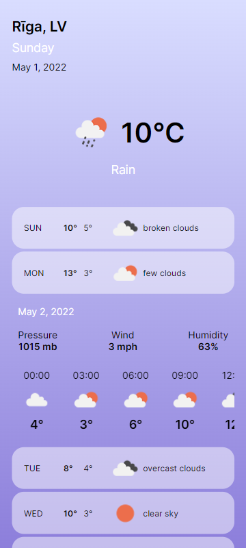

#  5 Days Weather App 

An application shows the 
weather forecasts for the upcoming 5 days, based on
the end-user location. If the location is not
allowed then Riga, Latvia is shown instead.

OpenWeatherAPI 
provides the forecast information, while end-user location 
coordinates provided by JavaScript Window Navigator.

An hourly forecast is represented by Swiper.js

This project was bootstrapped with Create React App.

## Available Scripts

In the project directory, you can run:

### `npm start`

Runs the app in the development mode.\
Open [http://localhost:3000](http://localhost:3000) to view it in your browser.

### `npm test`

Launches the test runner in the interactive watch mode.\
See the section about [running tests](https://facebook.github.io/create-react-app/docs/running-tests) for more information.

### `npm run build`

Builds the app for production to the `build` folder.\
It correctly bundles React in production mode and optimizes the build for the best performance.
